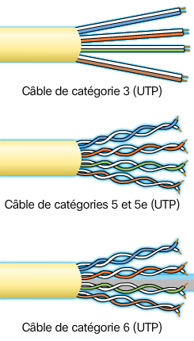
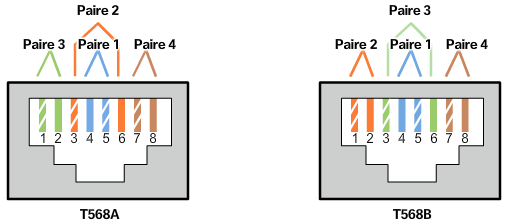
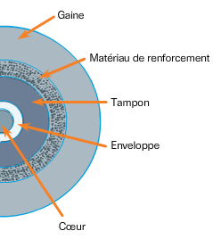

# Chapitre 4 : Accès réseau

## Couche physique

Apres la segmentation et la formation des trames par la couche liaison de données, la couche physique transmet individuellement les trames sur la canal de communication puis les signaux reçu par le destinataire qui reconstitue les trames et le désencapsule pour les interpréter.

Il existe 3 formes éléménetaires de supports physiques :

* **Câble en cuivre** Les signaux sont des impultions éléctriques
* **Câble à fibre optique** Les signaux sont des variations de lumière
* **Sans fil** Les signaux sont des variations de transmission d'hyperfréquence

Tout ces aspects sont gèrés par des organismes de normalisation suivants : 

* ISO (International standrards Organization)
* TIA/EIA (Telecomunication industry association/Electronic industries association)
* IUT (Union international des télécommunication)
* ANSI (American National standards institute)
* IEEE (Institute of Electrical and Electronics Engineers)
* D'autres autorités gouvernementales comme la FCC ou l'ETSI
* Des organismes locaux tels que la JSA/JIS, la CENELEC ou le CSA

Cette couche physique couvre 3 grandes fonctions :

* Les composants physiques en charge de transmettre le signal tel que les ports ethernet, les cables ou autres systèmes
* Le codage permettant de convertir le flux de données dans une suite de variations compréensible par les deux éxtremités du canal de transmission
* La méthode de signalisation permettant de représenter un 1 ou un 0 dans le canal de transmission

### Bande passante & Débit

La bande passante est la capacité du support à transporter les données. On mesure cette bande passante par une quantitée de données pouvant circuler sur une certaine periode. Elle est le plus souvent exprimée en KBit/s, e, MBit/s ou en GBit/s.

Cette bande passante peut varier selon les propriétés du support physique et les téchnologies choisis pour signaler ou détècter les signaux.

Le débit est une mesure éfféctuer par la mesure de la quantitée de données échangée durant une certaine durée. Ce débit n'attein pas souvent la bande passante estimée car il varie selon :

* La qualité du trafic
* Le type de trafic
* La latence crée par le nombre de périphériques sur le réseau, c'est a dire le temps nécéssaire pour les données de voyager d'un endrois à un autre.

Le *Debit applicatif* mesure quand a lui le débit utilisable et exclue la surcharge de traffic du réseau par l'etablissement de connexion ou les accusés de récéption.

## Cuivre

Le support en cuivre représente un système bon marché de communication mais présente un probléme: les perturbations. En effet, un courant electrique peut etre perturbé de multiples façon mais en voici les deux principaux :

* **Interferances éléctromagnétiques (EMI) et les interferances radioelectriques (RFI)** Ces interferances produites par des agents exterieurs peuvent modifier le signal; on peut contrer ce phénomène par le blindage des cables réseaux. 
* **Diaphonie** Un phénomène ou deux cables conjoints se perturbent; on peut contrer ce phénomène par la torsade des cables.

Il est alors logique que plus un cable est long plus il est sujet aux perturbations, il faut donc se réstreidre dans la longeure de ceux ci.

Il existe 3 principaux supports en cuivre :

* **UTP (paires torsadées non blindés)** Le type de cable le plus repéndu terminé par une connexion RJ-45; il se compose de 4 paires de fils entourés d'une gaine
* **STP (Paires torsadés bindés)** Plus onereux, il présente en plus des propriétés de l'UTP, un filet de métal qui, corrèctement mis a la terre, permet de contrer les interferances exterieurs.
* **Coaxial** Tends a se faire remplac"é par les cables à paire torsadés, ils se présentent par un cable conducteur puis un blindage séparés par une gaine; ils sont toute fois encore utilisés dans les connexion sans fil ou de câble internet

Les cablages en cuivre présentes des risques de sécurité en matière d'incendie due a la faible protection de ceux ci mais aussi éléctriques dans le cas d'un dysfonctionnement ou de la foudre, envoyant un fort courant des le cable.

### UTP

Les cables UTP ne disposent pas de protection contre les perturbation exterieurs, on suis alors les solution suivantes : 

* **Annulation** Par le couplage des fils qui ont un champ magnétique inverse, on arrive a annuler leurs perturbations et celles de l'exterieur.
* **Nombre de torsades** Pour eviter tout problème on varie le nombre de torsade par pair de fils sur chacune des paires du cable

Les cables sont divisés en catégories permettant un plus ou moins gros débit

|Categorie|Debit|
|---------|-----|
|3|<100 MBit/s|
|5|100 MBit/s|
|5e et 6|1000 MBit/s|
|6e|10 GBit/s|

Les cables UTP sont souvent terminés par des conecteurs RJ-45 qui doivent etre de bonne qualité pour permettre de bonne performances.

Pour parfaitement repondre aux attentes, on doit corrèctement choisir les cables en fonction de leur organisations internes, on a donc :

* **Câble ethernet droit** Le cable le plus utilisé et présente la même configuration des deux cotés; O l'utilise pour connècter un hote a un périphjérique réseau; On retrouve alors deux connècteurs T568A
* **Câble ethernet croisé** Moins utilisé et présente des cables inverses d'un coté et de l'autre; On l'utilise pour connècter deux appaleils similaires; On y retrouve alors les deux connècter, un de chaque cotés
* **Câble inversé** Réservé à cisco, il permet une communication entre le prot série d'une machine et le port console d'un routeur.

### Fibre Optique

La fibre optique est un fil pur et transparent de la taille d'un cheveux humain. Les données sont codées par des impultions lumineuses. On utilise la fibre optique pour relier des périphériques réseaux le plsu souvent car elle permet des débits tres important qu'elle est la seul a pouvoir supporter.

La technologe de fibre optique est actuellement utilisée dans :

* Les réseaux d'entreprise
* La technologie FTTH (Fiber to the home)
* Les réseaux de longue distance
* Les réseaux sous marins

La fibre optique se compose :

* D'un **coeur** transmettant la lumière
* D'une **enveloppe** Fonctionnant comme un miroir réfléchissant la lumière du coeur
* D'un **tampon** protegeant le coeur
* D'un **renforcement** evitant l'etirement de la fibre
* D'une **gaine** protegant le tout

Les signaux sont envoyés dans un fibre optique par le biais d'une DEL ou d'un laser. Mais les cables de fibre optique sont classés en deux types:

* **(SMF) Fibre Monomode** Le coeur est réduit et le lase est utilisé pour transmettre les donnés, la lumière passe de manière droite dans le coeur et ainsi empeche la dispersion; on l'utilise pour le transport de longue distance (100 Km minimum) car cette téchnologie est couteuse
* **(MMF) Fibre Multimode** Le coeur est plus large et utilise une DEL pour envoyer le signal; la lumière est réfléchie sur l'enveloppe et permet une transmission moins couteuse mais une dispertion plus importante; elle offre un debit de 10GBit/s sur 550 metres maximum

Les fibres optiques utilisent des types de connècteurs spécifiques :

* **ST** L'un des premiers connècteurs produits, il se connècte a l'aide d'une baillonette à tourner
* **SC** Un connecteur de forme carrée se clipsant pour verifier la connexion
* **LC** Une version réduite du connecteur SC
* **LC bidirectionnel** Dispose de deux connècteurs pour une connexion bidirectionnel

Dans tout les cas, une fibre optique est monodirectionnel, il est ainsi requis de connècter deux fibres.

On choisira la fibre optique sur des installation nécéssitant un fort traffic comme les point d'entrée pour entrprise mais on préfèrera un réseau en cuivre pour disperser de maniere individuelle les acces au réseau car la technologie de fibre est encore couteuse et difficile à maintenir.

### Sans fil

Le sans fil est un réseau qui se déploie rapidement due aux nouveaux périphériques et nouveaux usages. En revanche la communication sans fil impose une zone de couverture résetreinte, des interferances plus présentes, une sécurité moins importante et un support partagé par de multiples appareils pouvant être surchargé.

Le sans fil impose que les bits sont codés sur un signal radio et implique du materiel spécifique pour emettre et recevoir ce type de connexion.

Nous allons traiter ici les normes sans fil de courte ou moyenne portée soit : 

* **WiFi** La téchnologie WLAN se basant sur loe protocole CSMA/CA; La carte réseau commence par écouter avant d'emettre pour eviter toute collision
* **Bluetooth** Une téchnologie de réseau personnel (SAN) utilisant un protocole de jumelage et permettant une communication sur 100m maximum
* **WiMax** Une téchnologie sans fil se basant sur une topologie point-à-multipoint pour fournir l'acces au réseau

Mettre en place un réseau local sans fil implique de mettre en place certains systèmes tel qu'un point d'acces sans fil ainsi qu'une carte sans fil sur chaque hote. Les equipements doivent etre choisis avec soins sans quoi, les equipement risuqe une incompatibilité.
