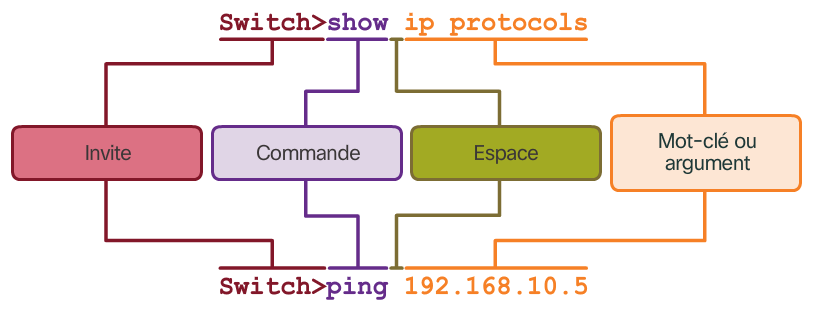

# Configuration d'un système d'exploitation réseau

Chaque machine nécéssite un système d'exploitation pour fonctionner y compris les machines réseau. Nous allons voir ici les systèmes d'exploitation réseau Cisco appelés aussi IOS.

## Système d'exploitation

Le système d'exploitation fait le lien entre l'utilisateur et le matériel. Il est composé d'une interface pouvant etre grapĥique (basé sur des fenêtres) ou en ligne de commandes (interpréteur de texte). Et d'un noyau qui fait le lien entre l'interface et le matériel.

## IOS

### Acces

Pour accèder au système IOS, on peut utiliser plusieurs méthodes ayant chacune ses avantages et ses inconvénients.

* **Console** Un port physique de gestion d'un système pouvant être accedé hors réseau et utile pour la maintenance du périphérique, il utilise un cable spécifique
* **SSH (secure shell)** permettant de se connecter a distance au système
* **Telnet** Méthode non sécurisée d'accès, tout les mots de passe et les commandes sont transmis en clair
* **AUX** Ancien port utilisant une connèxion téléphonique et un modem pour être administré

### Modes de commande

Il existe deux grands modes de commande permettant a l'utilisateur de faire plus ou moins d'actions.

* **Mode utilisateur** visible par le prompt `>`, permet des actions limités de monitoring mai empeche toute modification de la configuration.
* **Mode privilègié** visible par le prompt `#`, permet d'executer des opérations de maintenance et de configuration du routeur. On entre dans ce mode par la commande `enable` depuis le mode utisateur
* **Mode de configuration** visible par le prompt `(config)#` et accessible par l'intermédiere du mode privilègié, on peut y modifier la configuration du périphérique. On entre dans ce mode avec la commande `configure terminal`
* **Mode de configuration de ligne** visible par le promte `(config-line)#` et accessible par le mode de configuration, il permet de modifier la configuration des access console, ssh ou telnet. On entre dans ce mode avec la commande `line`
* **Mode de configuration d'interface** visible par le prompte `(config-if)#` et accessible depuis le mode de configuration, il permet de modifier la configuration relative aux interfaces réseau. On entre dans ce mode avec la commande `interface`

### Structure des commandes

Une commandes IOS est constituée de plusieurs éléments :



IOS implémente des fonctionnalités d'aide accessible par la commande `?` a tout instant. De plus entrer une sytaxe incorrècte vous sera informé dans l'invité.

### Raccourcis clavier

Lors de l'edition d'une commande

|Touche|Description|
|------|-----------|
|`Tab`|Complète le nom de la commande|
|`CTRL+D`|Efface le carractère a l'emplacement du curseur|
|`CTRL+K`|Effece tout les carractères jusuqu'a la fin de la ligne|
|`Esc+D`|Efface tout les carractères du curseur jusqu'a la fin du mot|
|`CTRL+U` `CTRL+X`|Efface tout les carractères jusqu'au debut de la ligne|
|`CTRL+W`|Efface le mot a gauche du curseur|
|`CTRL+A`|Deplace le curseur au debut de la ligne|
|`CTRL+E`|Deplace le curseur a la fin de la ligne|
|`Esc+B`|Deplace le curseur d'un mot vers la gauche|
|`Esc+F`|Deplace le curseur d'un mot vers la droite|
|`CTRL+R`|Rapelle l'invité de commande|

|Touche|Description|
|------|-----------|
|`CTRL+C`|Quitte le mode configuration|
|`CTRL+MAJ+6`|Intérromp une commande de recherche DNS, traceroute ou ping|

Lors d'un invité "More"

|Touche|Description|
|------|-----------|
|`Entrée`|Avance d'une ligne|
|`Espace`|Avance d'une page|
|Autre chose|Quitte l'affichage "More"|

### Nom de périphérique

Le nom de périphérique permet de reconnaitre un périphérique sur le réseau. Ce nom doit :

* Débuter par une lettre
* Ne pas contenir d'espace
* Se terminer par une lettre ou un chiffre
* Ne peut comporter des lettres, des chiffres et des tirets
* Comporter moins de 64 carractères

Pour configurer le nom de périphérique (nom d'hote), dans le mode de configuration, on doit utiliser la commande `hostname` suivi du nouveau nom du périphérique.

> Exemple :
> ```
> Switch# configure terminal
> Switch(config)# hostname SW-Floor-1
> SW-Floor-1(config)#
> ```

On peut annuler les changement en utilisant `no hostname`.

### Sécurité

Les systèmes IOS permettent, pour sécuriser le materiel, les actions suivantes : 

* Ajouter un mot de passe au mode d'execution privilegié
* Ajouter un mot de passe au mode utilisateur
* Ajouter un mot de passe lors de l'access a distance
* Chiffrer les mots de passe
* Ajouter une notification légale

#### Mots de passe 

On ajoute un mot de passe lors de l'acces au mode d'execution provilegié avec la commande `enable secret` suivi du mot de passe. Cette commande doit etre éxécutée dans le mode de configuration globale.

On ajoute un mot de passe lors de l'acces utilisateur avec la commande `password` suivi du mot de passe. Cette commande doit etre éxécutée dans le mode de configuration en ligne (`line console 0`). On active ensuite l'authentification avec la commande `login` (on peut la désactiver avec `no login`).

On peut en faire de même pour les acces distants via telnet ou ssh en utilisant les même commandes que précédemment mais dans le mode de configuration vty (`line vty 0 15`).

Les mots de passe sont alors ecris en clair dans les fichiers startup-config et running-config ce qui peut représenter un problème de sécurité. Pour activer le chiffrement des mots de passe on peut utiliser la commande `service password-encryption` dans le mode de configuration global.

#### Message légal

Pour prévenir de l'aspect privé du matériel on peut mettre en place une banière qui s'affichera a chaque connexion. Pour se faire on utilise la commande `banner motd #<message>#`. On ecris alors le message entre les `#`.

### Fichiers de configuration

Il existe deux fichiers de configuration sur le système IOS:

* **startup-config** La configuration dans la mémoire vive et non volatile qui lui permet d'être conservée malgré l'arret du système.
* **running-config** Une copie de startup-config utilisée par le système. Cette configuration est réinitialisée lors du redémarrage de la machine.

Pour afficher une des deux configuration on utilise la commande `show` suivi du nom de la configuration à afficher.

Pour enregister la configuration courante dans la mémoire et ainsi persister cette configuration on utilise la commande `copy running-config startup-config`.

Si uen configuration non voule viens à etre ajoutée on peut ainsi utiliser la commande `reload` pour recharger le périphérique et ainsi revenir a la configuration startup-config. Dans le pire des cas on peut supprimer la configuration initiale avec `erase startup-config`. Cela aura pour effet de réinitialiser la configuration à son état original au prochain rechargement.

## Adresse IP

Une adresse IP est le principal outil permettant aux périphériques de se localiser entre eux. Une adresse IP est composée de 4 nombres de 0 à 255 séparés par des points.

Une adresse IP peut etre attribuée a chaque port physique et aux interfaces virtuelles d'appreils cisco.

====> 2.3.1.2 <====