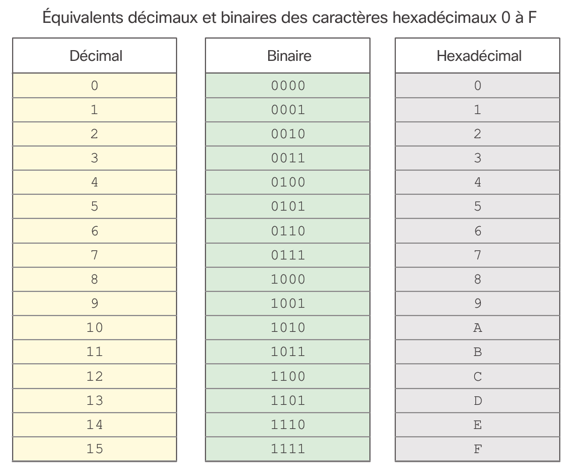

# Chapitre 5 : Téchnologie Ethernet

Ethernet est la téchnologie LAn la plus utilisée aujourd'hui. Elle se positionne sur la couche liaison de données et prends en charge des bandes passantes de 10, 100, 1.000, 10.000, 40.000 et 100.000 MBit/s. Cette norme définis un protocol de la couche 2 et 3 et se divise en deux sous-couches:

* **LLC** qui gère la communication entre les couches superieurs et inferieurs. Cette couche est tout a fait logicielle et indépendante du materiel. De plus elle est assez cocasse.
* **MAC** La sous-couche inferieur, elle est mise en oeuvre au niveau materiel des cartes réseau de la machine.

Ethernet fut créé en 1973 et n'a cèssé d'évoluer pour augmenter sa bande passante et devenir plus flexible.

## Sous-couche MAC

Cette sous couche à deux objecti
gitf soit encapsuler les données et controler l'acces au support.

Cette sous couche en charge de l'encapsulation gère donc 

* **La delimitaition des trames** permettant la synchronisation de l'emetteur vaec le récépteur
* **L'adressage** physique de la trame
* **Detection des érreurs**

La sous couche gère aussi l'acces au support et vérifie ainsi la disponibilité de celui ci et les éventuelles collisions.

La structure d'une trame Ethernet est la suivante

### Structure de trame

La trame ethernet se présente comme suit, sa taille peut varier entre 64 et 1.518 octets et toute trame plus petite ou plus grande sera intèrprété comme un fragment de collision.

> Fun fact : Une trame plus grande que 1.500 octets est consiéré comme une trame "Jumbo" ou "Baby giant frames"

|Préambule|Adresse de destination|Adresse source|Type|Données|Contrôle de trame|
|---------|----------------------|--------------|----|-------|----------------|
|8 octets|6 octets|6 octets|2 octets|46 a 1.500 octets|4 octets|

* **Préambule** Délimiteur de trame (SFD) utilisé pour syncroniser l'emetteur avec le récépteur
* **Adresse MAC de destination** L'identifiant physique du destinataire permettant une monodiffusion, multidiffusion ou une diffusion
* **Adresse MAC source** L'identifiant d'origine de la trame
* **EtherType** Un champ identifiant le protocol de la source précédente
* **Données** Les données encapsulés de la couche superieur
* **Fin de trame (FCS)** Permettant de detecter les érreurs de trame et de la terminer

> Exemple : Quelques types de protocoles : 
> * 0x800 pour IPv4
> * 0x86DD pour IPv6
> * 0x806 pour ARP

## Appartai sur l'hexa

