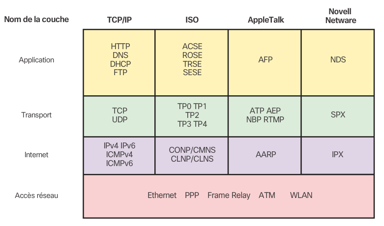
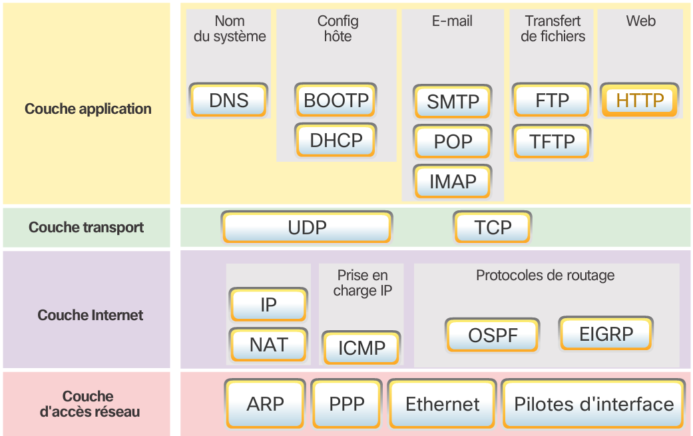

# Chapitre 3 : Protocoles et communication réseau

## Structure d'une communication

Toute communication peut être représenté par 5 elements principaux et la communication etre ordinateurs ne fait exception : 

* La source du méssage à émettre (La machine source)
* L'émétteur du signal (la carte réseau source)
* Le support de transmission (cuivre, air ou fibre optique)
* Récépteur du message (carte réseau de destination)
* Destinataire du message (machine de destination)

Pour convenablement communiquer, les machines doivent s'accorder sur une langue partagée pour communiquer. C'est cela que l'on apelle *protocole*. Il en existre un grand nombre qui sont normalisés pour permettre une communication corrècte. ce protocol définis les informations que la machine source doit fournir pour se faire comprendre par le réseau.

Pour corrèctement transmettre le message, les machines utilisent non pas un seul protocol mais une suite de protocol ajoutant chaqun d'eu de nouvelles informations permettant de transmettre le message. On apelle cette organisation la *suite de protocoles*. Ainsi le message à envoyé est encapsulé par chacun des protocoles permettant sa transmission.

### Codage

Pour les besoins de la transmission, les données qui vons etre envoyés doivent subir une transformation permettant de les rendre compatibles avec le support de trsnmission et le protocol utilisé. C'est cette opération que l'on apelle *codage*

> Exemple : Dans une conversation téléphonique, chaque son reçu est codé sous forme de bit puis envoyé au destinataire qui reconstitue le son a parti des informations reçues.

### Encapsulation

Le message brut, même codé, ne peut etre envoyé tel quel sur le réseau, il faut lui fournir d'autre informations comme le destinatire de la lettre ou l'éxpéditeur. Ces informations sont ajoutés au début ou a la fin du message à envoyé. L'encapsulation consiste alors en l'ajout d'informations au message brut en fonction des informations requises par le réseau. L'ensemble du message encapsulé est appelé *trame* et peut etre envoyé sur le réseau. Il peut y avoir plusieurs phases d'encapsulation d'un message.

Par exemple dans le cas d'une trame HTTP on trouve le contenu de la page a affcicher dans les données utilisateur puis une sére d'encapsulation ajoutent des informations a la trame permettant de préciser sa destination, la version des protocoles utilisés, et bien d'autres choses.

### Taille

Pour réspècte le protocol utilisé pour la transmission, le message peut etre divisée en plusieurs *trames* permettant ainsi de ne pas engorger le réseau.

### Syncronisation et gestion des trames

Lorsque deux hotes envoient une trame au même moment sur le réseau, il se produit une *collision*. Pour éviter ce genre de chose, le protocol doit définir une *méthode d'acces* définissant le moment ou les hotes doivent parler et que faire en cas d'érreur.

Pour éviter d'engorger le réseau, le protocol doit aussi spécifier un système de *controle de flux* pour donnér un chance à chaque hote d'envoyer des données sur le réseau.

Enfin, le protocol doit aussi définir un *délai d'attente*, qui dépassé, autorisera l'hote émétteur sans réponse de considèrer qu'aucune réponse n'à été donnée.

### Méthode d'envoie

L'envoie d'une trame peut s'éfféctuer de 3 façon différentes :

* **Monodiffusion** On envoie la trame a un seul hote
* **Multidiffusion** On envoie la trame a un groupe d'hotes
* **Diffusion** On envoie la trame a tout les hotes du réseau

Chacune des trames peut demander ou non un accusé de récéption.

## Protocol réseau

Les protocols qui régissent les réseaux sont des protocoles définis, précis et accèptés par toutes les machines qui l'utilisent. Il existe de nombreux protocoles et ces protocols sont organisés en *suites de protocols* permettant une bonne communication.

Un protocol peut etre :

* **Ouvert** Il est alors normalisé par un organisme de normalisation et peut etre utilisé partout et par tous
* **Propriétaire** Il est alors normalisé par l'entreprise qui l'a crée et ne peut etre utilisé que par cette même entreprise.

Il existe de nombreuses suites des protocoles mais en voici quelques exemples

La suite de protocoles TCP/IP se compose aujourd'hui beaucoup de protocoles donnés dans la figure suivante.

Les protocoles sont empilés en couches. Pour utiliser un protocol application, on a alors besoin d'utiliser un ou plusieurs protocoles par couche inferieur et d'effectuer l'encapsulation.

### Protocoles application

* **DNS** Pour Domaine Name System, permet de traduire le noms de domaine en adresses IP
* **BOOTP** Prédécesseur de DHCP, il permet a une pachien de connaitre son IP sur le réseau
* **DHCP** Pour Dynamic Host Configuration, attribue dynamiquement des adresses IP aux clients et permet de réutiliser les adresses ip non utilisés.
* **SMTP** Pour Simple Mail Transfert Protocol, permet aux client d'envoyer un email a un serveur de messagerie et au serveur d'envoyer ce mail à d'autres serveurs
* **POP** Pour Post Office Protocol, permet de récupèrer des emails depuis un serveur de messagerie, ces emails sont téléchargés du serveur vers le bureau
* **IMAP** Pour Internet Message Access Protocol, permet d'accèder aux emails d'un serveur de messagerie et conserve ces email a distance
* **FTP** Pour File Transfert Protocol, définis les rêgles qui permettent à l'utilisateur d'un hôte d'accèder à des fichiers sur un autre hôte du réseau et de transfèrer des fichier vers cet hote distant
* **TFTP** Pour Trivial file transfert protocol, permet de transfèrer des fichiers simples sans connexion et sans accusé de réception
* **HTTP** Pour Hypertext Transfer Protocol, permet de transfèrer des mesdias, textes et graphiques sur le web.

### Protocoles de transport

* **UDP** Pour User datagram Protocol, permet de transferer des paquet d'un hote vers un autre sans accusé de réception.
* **TCP** Pour Transmission Control Protocol, permet une communication fiable entre les processus de deux hotes distants avec accusé de réception

### Protocoles Internet

* **IP** Pour Internet Protocol, permet de regrouper les messages en paquets et indiquer l'adresse de destination
* **NAT** Permet de convertir les adresses locales en adresses globales sur le réseau mondial
* **ICMP** Pour Internet Control Message Protocol, permet de signaler a l'hote distant les érreur survenues lors de la transmission
* **OSPF** Pour Open Shortest Path First, permet de router les paquets dans la bonne direction par une conception hierarchique des zones
* **EIGRP** Pour Enhaces Interior Gateway Routing Protocol, un protocol propriétaire Cisco permettant de donner une métrique apropriée en fonction de la bande passante

### Protocoles d'acces réseau

* **ARP** Pour Address Resolution Protocol, Fournis un mappage dynamique entre une adresse IP et une adresse physique
* **PPP** Pour Piont-to-point Protocol, permet d'encapsuler les paquets pour les transmettre par une connexion série
* **Ethernet** Le protocol le plus utilisé en local permettant de définir les rêgles de cablage et de signalisation
* **Pilotes d'interface** Donne les instructions à l'ordinateur pour communiquer avec ses interfaces réseau